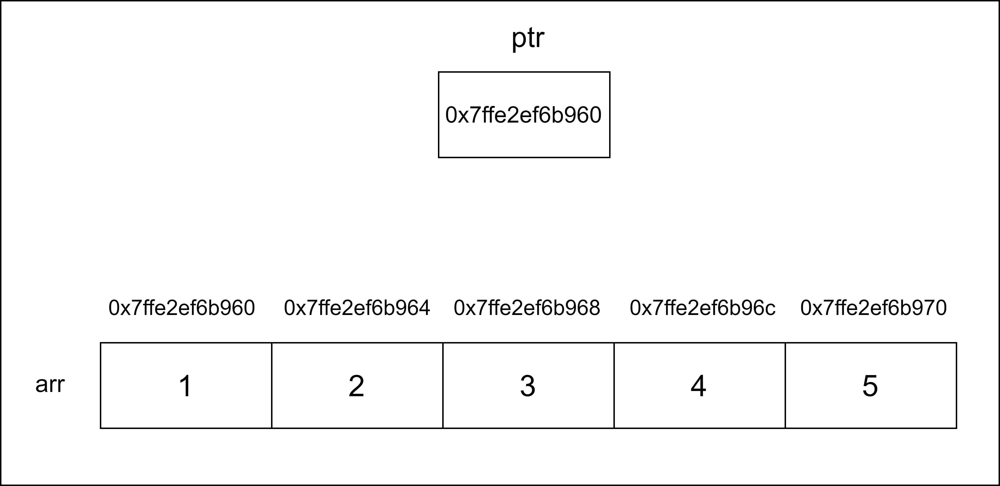

# 20CYS113 - Computer-Programming and 20CYS181 - Computer Programming Lab 
  


## Pointer Arithmetic 

```
#include <stdio.h>

int main() {

	int arr[5] = {1, 2, 3, 4, 5};
	int *ptr = arr;  // *ptr =&arr; Points to the first element of the array

	printf("Address of the pointer: %p\n", ptr); 
	
	ptr++;  // Moves the pointer to the next element
	
	printf("Address of moving the pointer forward by 1: %p\n", ptr); 
	printf("Value at this address: %d\n", *ptr);  // Output: 2

	ptr--;  // Moves the pointer back to the previous element

	printf("Address of moving the pointer back by 1: %p\n", ptr);
	printf("Value at this address: %d\n", *ptr);   // Output: 1
	
	ptr = ptr + 4;  // Moves the pointer forward by 4 elements

	printf("Address of moving the pointer forward by 4: %p\n", ptr);
	printf("Value at this address: %d\n", *ptr);   // Output: 5
	
	ptr = ptr - 2;  // Moves the pointer back by 2 elements

	printf("Address of moving the pointer back by 2: %p\n", ptr);
	printf("Value at this address: %d\n", *ptr);   // Output: 3

	return 0;
}

```

## Illustration

<p align="center">
	
</p>
