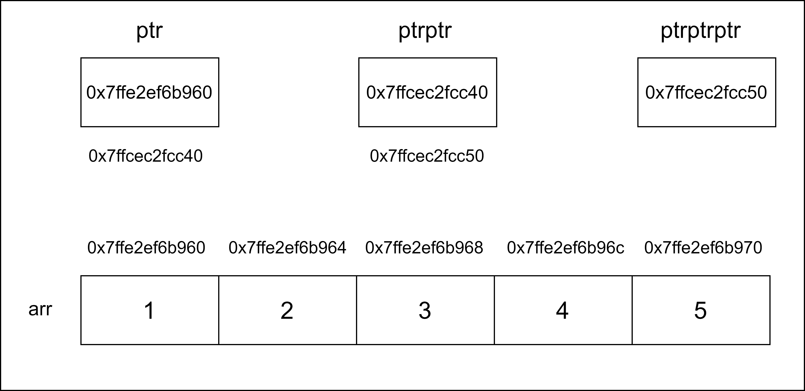

# 20CYS113 - Computer-Programming and 20CYS181 - Computer Programming Lab 
  


## Pointer to a Pointer 

```
#include <stdio.h>

int main() {
    int value = 42;
    int *ptr = &value;     // pointer to an int
    int **ptrToPtr = &ptr; // pointer to a pointer

    printf("Value: %d\n", value);
    printf("Value via pointer: %d\n", *ptr);
    printf("Value via pointer to pointer: %d\n", **ptrToPtr);

    return 0;
}
```
```
      +-------+        +--------+             +--------+
value |  42   |   ptr  | &value |   ptrToPtr  |  &ptr  |
      +-------+        +--------+             +--------+
        0x1000           0x2000                 0x4000
```
```
      +-------+        +--------+             +--------+
value |  42   |   ptr  | 0x1000 |   ptrToPtr  | 0x2000 |
      +-------+        +--------+             +--------+
        0x1000           0x2000                 0x4000
```

## Illustration

<p align="center">
	
</p>

